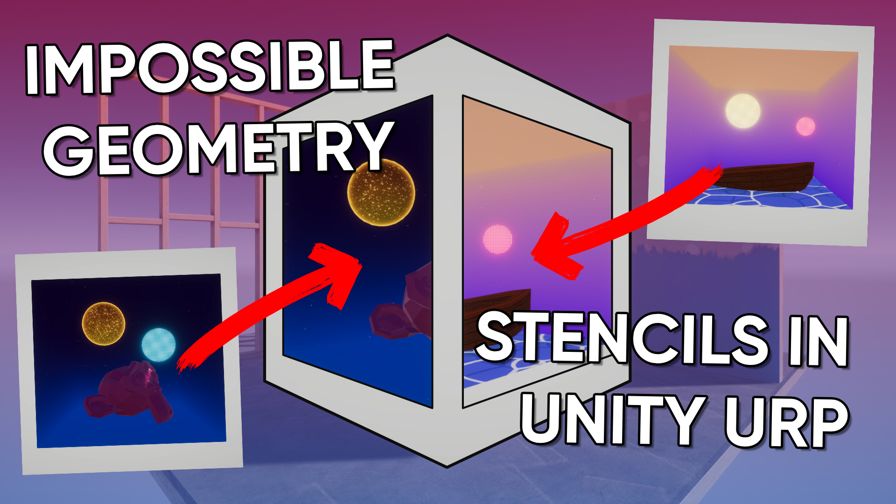

# Impossible Geometry with Stencil Shaders in Unity URP

A shader project for Unity URP featuring impossible geometry shaders like those seen in the game *Antichamber*.

## Overview

This repository features a stencil mask shader which defines a region of space, behind which a specific object layer appears. Universal Render Pipeline's Renderer Features are used to render those layers. By placing several objects in the same physical space but on different layers, you can create impossible geometry where different objects only appear when viewed from certain positions in space.

## Software

This project was created using Unity 2020.3.21f1 and Universal Render Pipeline 10.6.0.

## Tutorials

This project is part of a tutorial available in the following places:
- YouTube: https://www.youtube.com/watch?v=EzM8LGzMjmc
- Website: https://danielilett.com/2022-01-05-tut5-22-impossible-geom-stencils/

## Authors

This project and the corresponding tutorial was created by Daniel Ilett.

## Release

This project was released to the public on January 5th 2022.
